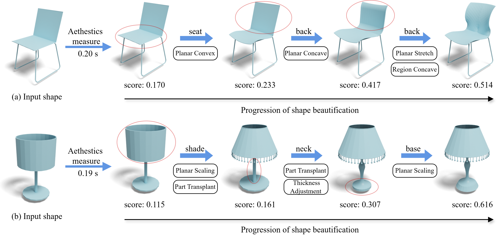

# Aesthetic3D: Incorporating Shape Aesthetic Measures into 3D Modeling Interfaces




> [Deng Yu](https://dengyuhk.github.io/), [Jianing Guo](), [Hui Ye](), [Pengjie Ren*](), [Hongbo Fu*](https://hongbofu.people.ust.hk/), [Manfred Lau*](https://sites.google.com/site/manfredlau/)
>
> [[Paper]](https://dl.acm.org/doi/10.1145/3804501) [[Project Page]](https://dengyuhk.github.io/Aesthetic3D/) [[Dataset]](#Dataset)
>
> Accepted by ACM SIGGRAPH I3D 2026

### Prerequisites
---

Python version:

> **python 3.10**

Clone this repository and install the dependent libraries (virtual environment recommended):

``` sh
git clone https://github.com/dengyuhk/Aesthetic3D
cd Aesthetic3D

python -m venv aesthetic3d_venv
source aesthetic3d_venv/bin/activate

pip install -r requirements.txt
```

### Getting Started

---

#### Dataset Details
You can download our created [dataset](https://drive.google.com/drive/folders/1UVn_-HoJXqiC3gPlTHCLDc0Cfuyjj9Z4?usp=sharing) and put `3D_models`into the `Aesthetic_data` folder and `training_data` into `data` folder for further training and testing. If you download and use the dataset, you agree to the below items:

>- The dataset is available for non-commercial research purposes only.
>- You agree not to reproduce, duplicate, copy, sell, trade, resell or exploit for any commercial purposes any portion of the images and any portion of derived data.
>- We reserve the right to terminate your access to the *Aesthetic3D* dataset at any time.

#### Project structure 

The full project structure should look like this:

```tex
Aesthetic3D/
    |-- Aesthetic3D_interface.blend         # Blender interface for 3D shape beautification
    |-- test.obj
    |-- requirements.txt
    |-- Aesthetic_data/
    |   |-- 3D_models/               	    # 3D models
    |   |   |-- chair/           		               
    |   |   |-- coffee_mugs/    			 
    |   |   |-- pedestal_tables/ 		 
    |   |   |-- table_lamps/     		
    |   |   |-- pairs           		
    |-- method/
    |   |-- data/
    |	|   |-- pre_rendered_3.pt 		    # multi-view images of shapes
    |   |   |-- IDmaps.pt        			# mapping between model ids and multi-view images
    |   |   |-- pairs_weighted_filtered.pt  # weighted pairwise aesthetic comparison data.
    |   |-- evaluation/
    |   |-- models/
    |   |-- render/
    |   |-- train/
    |   |-- config.py
    |   |-- script.sh
```

### Interactive Interface

---

Open our interface with Blender:

```bash
blender Aesthetic3D_interface.blend
```

### Network Training Details

----

You can train and test our network using the scripts:

```bash
## for training
python train/train_split.py --log_path Logs --batchSize 128 --save_rate 5 --architecture ModelImg2 --data_path ./data/pre_rendered_3.pt --pairs_path ./data/pairs_weighted_filtered.pt

## for inference on a single 3D model (OBJ format)
python evaluation/eval_vis.py --checkpoint ./train_logs/Logs1/Logs/paras_50.pth --mesh_path ./test.obj
```

### Acknowledgments

----

This network architecture is developed following  [ViT](https://github.com/lucidrains/vit-pytorch#simple-vit).

### BibTeX
---
```tex
@ARTICLE{yu2026aesthetic3D,
author = {Yu, Deng and Guo, Jianing and Ye, Hui and Ren, Pengjie and Fu, Hongbo and Lau, Manfred},
title = {Aesthetic3D: Incorporating Shape Aesthetic Measures into 3D Modeling Interfaces},
journal = {Proc. ACM Comput. Graph. Interact. Tech.},
year = {2026},
issue_date = {May 2026},
volume = {9},
number = {1},
doi = {10.1145/3804501}}
```

